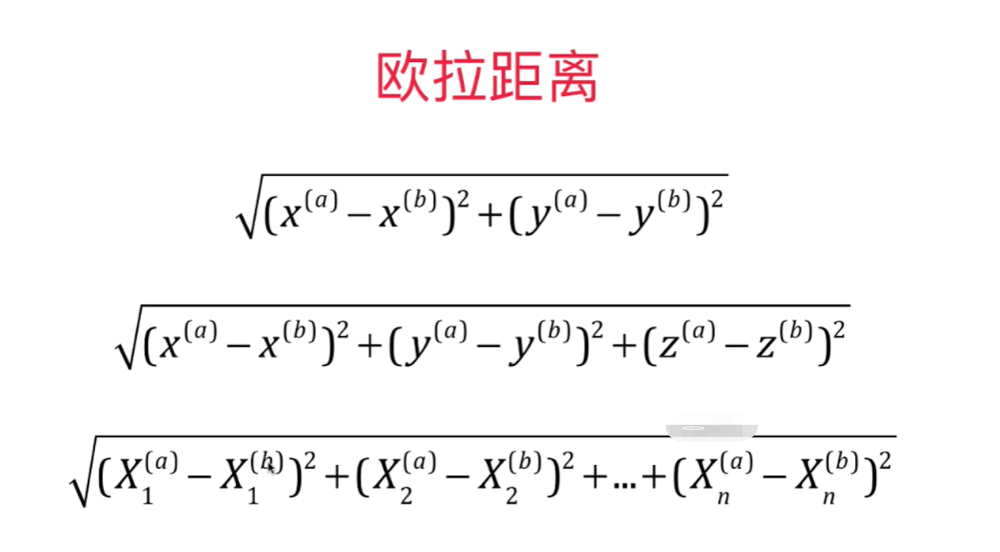
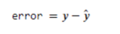

### 关于线性回归算法

- 解决回归问题
- 思想简单，容易实现
- 结果具有很好的解释性
- 蕴含机器学习中的很多重要的思想

什么是线性回归？

简单线性回归的原理以及数学推导

简单线性回归为一元线性回归模型，是指模型中只含有一个自变量和因变量，该模型的数学公式可以表示为y=ax+b+ε，a为模型的斜率，b为模型的截距，ε为误差。

对于简单线性回归，函数可以用可以用一个公式来表示，假设x和y之间存在这样的关系：

其中等号左边带的y是我们y的预测值，实际情况时我们预测的数值与实际数值之间的差异，就是残差，即：

我们的目的是使得预测值尽可能地接近实际值，即残差越小越好。也就是说，当我们找到一组（a, b），使得残差平方和最小时，就说明在某种程度上，
我们找到了预测效果最好的简单线性回归模型。
